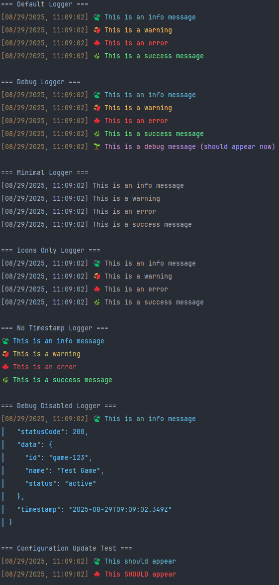

# LeafLogger

A lightweight, customizable logger with colorful output and emoji icons for Node.js applications.





## Features

-  Colorful log messages with RGB precision
-  Emoji icons for visual distinction
-  Timestamp support
-  Multiple log levels (error, warn, info, success, debug)
-  Configurable
-  Zero dependencies

## Installation

```bash
npm install leaf-logger
```

## Usage

### Basic Usage

```javascript
const LeafLogger = require('leaf-logger');

const logger = LeafLogger();

logger.info('This is an info message');
logger.warn('This is a warning');
logger.error('This is an error');
logger.success('This is a success message');
logger.debug('This is a debug message');
```

### Configuration

You can customize the logger behavior by passing a configuration object:

```javascript
const logger = LeafLogger({
    level: 'debug',     // Minimum log level to display
    timestamp: true,    // Show timestamps
    colors: true,       // Enable colored output
    icons: true,        // Show emoji icons
});
```

### Log Levels

Available log levels (in order of priority):
1. `error` - Critical issues
2. `warn` - Warning messages
3. `info` / `success` - Informational messages
4. `debug` - Debugging information (lowest priority)

When you set a level, all messages at that level and above will be displayed:
```javascript
const logger = LeafLogger({ level: 'info' }); // Shows info, success, warn, error
const debugLogger = LeafLogger({ level: 'debug' }); // Shows all messages
```

### Configuration Options

| Option | Type | Default | Description |
|--------|------|---------|-------------|
| `level` | string | `'info'` | Minimum log level (`error`, `warn`, `info`, `success`, `debug`) |
| `timestamp` | boolean | `true` | Show/hide timestamps |
| `colors` | boolean | `true` | Enable/disable colored output |
| `icons` | boolean | `true` | Show/hide emoji icons |

### Examples

#### Minimal Output
```javascript
const minimalLogger = LeafLogger({
    timestamp: false,
    colors: false,
    icons: false
});

minimalLogger.info('Simple message');
// Output: Simple message
```

#### Timestamp Only
```javascript
const timeLogger = LeafLogger({
    colors: false,
    icons: false
});

timeLogger.info('Timestamped message');
// Output: [14:30:25] Timestamped message
```

#### Colorful with Icons
```javascript
const visualLogger = LeafLogger();

visualLogger.error('Critical error!');
// Output: [14:30:25] 🍂 Critical error!
```

## Log Levels Reference

| Level | Color | Icon | Use Case |
|-------|-------|------|----------|
| `error` | Red | 🍂 | Critical errors and failures |
| `warn` | Amber | 🍁 | Warnings and non-critical issues |
| `info` | Sky Blue | 🍃 | General information |
| `success` | Mint Green | 🌿 | Successful operations |
| `debug` | Lavender | 🌱 | Debugging information |

## License

MIT © 2025